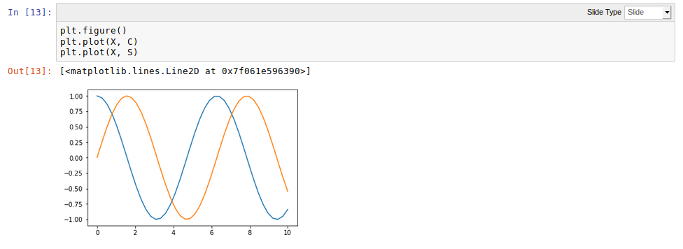
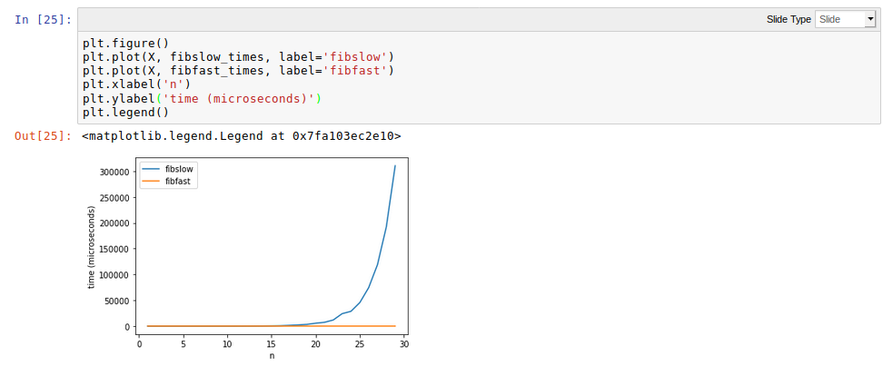

# Matplotlib-PyPlot
2D and 3D graphical repersentation of data

## Sin and Cos Plotting

## Sin and Cos Plotting with Labels

## Fibonacci Time graph plotting

## Realtime data Plotting

## 3D Plotting of data

